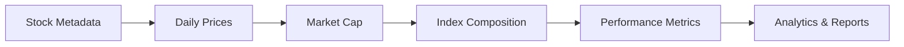

# Index Builder

[](https://www.python.org/downloads/)
[](LICENSE)
[](https://fastapi.tiangolo.com/)
[](https://www.docker.com/)
[](https://redis.io/)

<!-- Switch Badges
<p align="center">
  <a href="https://www.python.org/downloads/"></a>
    <a href="./LICENSE"></a>
  <a href="https://fastapi.tiangolo.com/"></a>
  <a href="https://pandas.pydata.org/"></a>
  <a href="https://www.docker.com/"></a>
    <a href="https://redis.io/"></a>
</p>
-->

> A comprehensive stock index construction and management system that creates equal-weighted indices from NYSE stocks with scheduled daily data ingestion, performance tracking, and REST API access.


## 📋 Table of Contents

- [Features](#-features)
- [Architecture](#-architecture)
- [Quick Start](#-quick-start)
- [Installation](#-installation)
- [Configuration](#-configuration)
- [Usage](#-usage)
- [API Reference](#-api-reference)
- [Database Schema](#-database-schema)
- [Development](#-development)
- [Contributing](#-contributing)
- [License](#-license)
- [Support](#-support)

## ✨ Features

- 📊 **Equal-Weighted Index Construction**: Build custom indices with top N stocks by market cap
- 🔄 **Data Ingestion Pipeline**: Automated data pipeline for stock prices and market cap
- 📈 **Performance Tracking**: Daily returns, cumulative returns, and composition changes
- 🚀 **REST API**: FastAPI-based endpoints for index management and queries  
- ⚡ **Caching**: Redis-based caching for improved performance
- 📤 **Export Capabilities**: Excel export functionality for analysis
- 🔌 **Multi-Provider Support**: Support for multiple data providers in future.
- 📝 **Comprehensive Logging**: Detailed logging across all components
- 🐳 **Docker Support**: Full containerization with Docker Compose

## 🏗️ Architecture

<div align="center">
  
</div>

The system follows a microservices architecture with clear separation of concerns:

- **Data Pipeline**: Handles stock data ingestion and processing
- **FastAPI Service**: Provides REST API endpoints
- **Redis Cache**: Improves performance with intelligent caching
- **SQLite Database**: Stores historical and real-time stock data

## 🚀 Quick Start

Get up and running in under 5 minutes using Docker:

```bash
# Clone the repository
git clone https://github.com/petrinax/index-builder.git
cd index-builder

# Start all services
docker-compose up --build
```

### Access the API
- **Swagger UI**: http://localhost:8000/docs
- **ReDoc**: http://localhost:8000/redoc


## 💻 Installation

### Prerequisites

- Python 3.11+
- Docker & Docker Compose (recommended)
- Git
- Redis (if not using Docker)

### Option 1: Docker Setup (Recommended)

```bash
# Clone and navigate to project
git clone https://github.com/petrinax/index-builder.git
cd index-builder

# Copy environment template
cp .env.example .env

# Start services
docker-compose up --build
```

### Option 2: Local Development Setup

```bash
# Clone repository
git clone https://github.com/petrinax/index-builder.git
cd index-builder

# Create virtual environment
python -m venv index-builder-venv
source index-builder-venv/bin/activate  # Windows: index-builder-venv\Scripts\activate

# Install dependencies
pip install -r requirements.txt

# Initialize database
python -m data_pipeline.init_database_pipeline

# Start Redis (separate terminal)
redis-server

# Run application
cd fast_app
uvicorn main:app --host 0.0.0.0 --port 8000 --reload
```

## ⚙️ Configuration

### Environment Variables

Create a `.env` file in the project root:

```env
# Database Configuration
DB_TYPE=sqlite
DB_PATH=data/stock_data.db

# Data Provider Configuration
DATA_PROVIDER=yfinance
MAX_WORKERS=15
FINNHUB_API_KEY=your_api_key_here  # Optional: for Finnhub provider

# API Configuration
DEBUG=false
API_HOST=0.0.0.0
API_PORT=8000

# Redis Configuration
REDIS_HOST=localhost
REDIS_PORT=6379
REDIS_DB=0
REDIS_TTL=600
CACHE_ENABLED=true

# Export Configuration
EXPORT_DIR=fast_app/exports
```

## 📖 Usage

### Data Ingestion

```bash
# Manual ingestion for specific exchange
python -m data_pipeline.ingestion_pipeline --exchange NYSE --period='1d'

# Historical data for specific date
python -m data_pipeline.ingestion_pipeline --exchange NYSE --target_date 2025-10-21

# Scheduled ingestion (add to crontab)
0 18 * * 1-5 cd /path/to/index-builder && python -m data_pipeline.ingestion_pipeline
```

### Building an Index

```bash
curl -X POST "http://localhost:8000/build-index" \
     -H "Content-Type: application/json" \
     -d '{
       "start_date": "2025-01-01",
       "end_date": "2025-10-21",
       "top_n": 100,
       "initial_nav": 1000.0
     }'
```

## 📚 API Reference

### Base URL
- **Local**: `http://localhost:8000`
- **Docker**: `http://localhost:8000`
- **Docs**: `http://localhost:8000/docs` (Interactive API Documentation)

### Core Endpoints

| Method | Endpoint | Description | Parameters |
|--------|----------|-------------|------------|
| `GET` | `/` | API health and information | - |
| `POST` | `/build-index` | Build equal-weighted index | `start_date`, `end_date`, `top_n`, `initial_nav` |
| `GET` | `/index-performance` | Get performance metrics | `start_date`, `end_date` |
| `GET` | `/index-composition` | Get index composition | `date` |
| `GET` | `/composition-changes` | Get composition changes | `start_date`, `end_date` |
| `GET` | `/export-excel` | Export data to Excel | `start_date`, `end_date` |
| `DELETE` | `/clear-cache` | Clear Redis cache | - |
| `DELETE` | `/reset-database` | Reset database tables | - |

### Example Requests:

<details>
#### <summary> <b>View API Examples </b> </summary>

#### Get Index Performance
```bash
curl -X GET "http://localhost:8000/index-performance?start_date=2025-01-01&end_date=2025-10-21"
```

#### Get Index Composition
```bash
curl -X GET "http://localhost:8000/index-composition?date=2025-10-21"
```

#### Export to Excel
```bash
curl -X GET "http://localhost:8000/export-excel?start_date=2025-01-01&end_date=2025-10-21" \
     --output index_export.xlsx
```

</details>

## 🗄️ Database Schema

### Core Tables

The system uses SQLite with the following schema:

<details>
<summary> <b>View Database Schema</b> </summary>

#### Stock Metadata
```sql
CREATE TABLE stock_metadata (
    symbol VARCHAR PRIMARY KEY,
    name VARCHAR,
    exchange VARCHAR,
    mic VARCHAR,
    currency VARCHAR,
    type VARCHAR,
    shares BIGINT,
    last_updated TIMESTAMP
);
```

#### Daily Stock Prices
```sql
CREATE TABLE daily_stock_prices (
    symbol VARCHAR,
    exchange VARCHAR,
    date DATE,
    open REAL,
    high REAL,
    low REAL,
    close REAL,
    volume BIGINT,
    last_updated TIMESTAMP,
    PRIMARY KEY (symbol, exchange, date)
);
```

#### Index Performance
```sql
CREATE TABLE index_performance (
    date DATE,
    nav REAL,
    daily_return REAL,
    cumulative_return REAL,
    top_n INTEGER,
    created_at TIMESTAMP,
    PRIMARY KEY (date, top_n)
);
```

#### Index Composition
```sql
CREATE TABLE index_composition (
    date DATE,
    symbol VARCHAR,
    exchange VARCHAR,
    market_cap REAL,
    price REAL,
    shares REAL,
    weight REAL,
    notional_value REAL,
    top_n INTEGER,
    created_at TIMESTAMP,
    PRIMARY KEY (date, symbol, exchange, top_n)
);
```

</details>

### Data Flow



## 🛠️ Development

### Project Structure

```
index-builder/
├── data_pipeline/          # Data ingestion and processing
│   ├── client.py          # Data provider clients
│   ├── database.py        # Database connections
│   ├── ingestion_pipeline.py  # Main ingestion logic
│   └── base_logging.py    # Logging configuration
├── fast_app/              # FastAPI application
│   ├── main.py           # API endpoints
│   ├── models.py         # Pydantic models
│   ├── services.py       # Business logic
│   ├── cache.py          # Redis caching
│   └── config.py         # Configuration
├── data/                  # SQLite database files
├── docs/                  # Documentation
├── csv_exports/          # CSV export files
└── docker-compose.yaml   # Container orchestration
```

<div align="center">
  <p>
    <a href="https://github.com/petrinax/index-builder">⭐ Star</a> •
    <a href="https://github.com/petrinax/index-builder/fork">🍴 Fork</a> •
    <a href="https://github.com/petrinax/index-builder/issues">🐛 Report Bug</a> •
    <a href="https://github.com/petrinax/index-builder/discussions">💬 Discuss</a>
  </p>
</div>

<p align="center">
<a href="https://www.linkedin.com/in/piyush-upreti/">
  
</a>
<a href="https://github.com/petrinax">
  
</a>
<a href="https://medium.com/@piyushupreti07">
  
</a>
<a href="https://mail.google.com/mail/?view=cm&fs=1&to=piyushupreti07@gmail.com">
  
</a>
</p>
